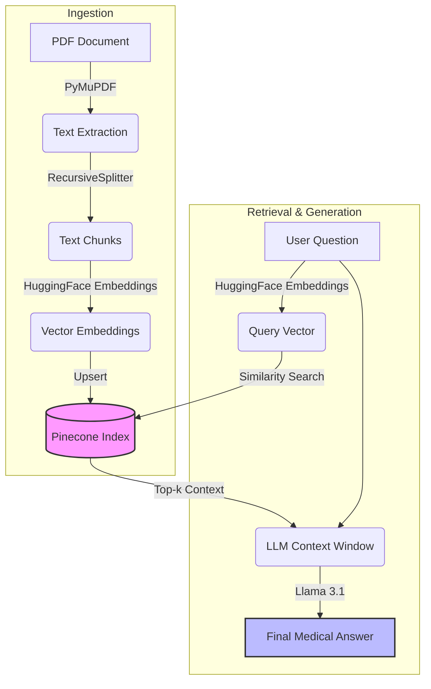

# 🩺 AI Powered Medical Chatbot

[](https://streamlit.io/)
[](https://www.python.org/)
[](https://python.langchain.com/)
[](https://www.pinecone.io/)
[](https://huggingface.co/)

**An intelligent RAG-based Medical Assistant built with Streamlit, LangChain, and Llama 3.1.**

This application allows users to upload medical PDF documents and ask context-aware questions. It leverages Retrieval-Augmented Generation (RAG) to provide accurate answers based *only* on the uploaded content, ensuring reduced hallucinations and high relevance.

---

## 🏗️ Architecture

The system follows a standard RAG pipeline, converting documents into vector embeddings and retrieving them for the LLM to generate answers.



---

## ✨ Features

- **📄 Document Ingestion**: Upload medical PDFs directly via the sidebar.
- **🧠 Advanced RAG**: Uses `Pinecone` for fast similarity search and `HuggingFace` embeddings.
- **💬 Interactive Chat**: persistent chat history and stream-based responses.
- **🤖 Llama 3.1 Powered**: Utilizes the powerful Llama 3.1 model for high-quality natural language generation.
- **🎨 Beautiful UI**: Clean Streamlit interface with animations and custom styling.

---

## 🚀 Getting Started

Follow these instructions to set up the project locally.

### Prerequisites
- Python 3.9 or higher
- A [Pinecone](https://www.pinecone.io/) API Key
- A [HuggingFace](https://huggingface.co/) Token (for Llama model access)

### Installation

1. **Clone the repository**
   ```bash
   git clone https://github.com/irkky/Medical-RAG-Streamlit-Application.git
   cd "Medical RAG Streamlit Application"
   ```

2. **Create a virtual environment**
   ```bash
   python -m venv venv
   # Windows
   .\venv\Scripts\activate
   # Mac/Linux
   source venv/bin/activate
   ```

3. **Install dependencies**
   ```bash
   pip install -r requirements.txt
   ```

4. **Configure Environment Variables**
   Create a `.env` file in the root directory and add your keys:
   ```ini
   PINECONE_API_KEY=your_pinecone_api_key
   PINECONE_INDEX_NAME=your_index_name
   HUGGINGFACEHUB_API_TOKEN=your_hf_token
   ```

---

## �️ Usage

1. **Ingest Data**
   Place your medical PDF documents in the `data/raw/` folder. then run:
   ```bash
   python src/ingestion.py
   ```
   This will load, split, embed, and store your documents in Pinecone.

2. **Run the Streamlit App**
   ```bash
   streamlit run app.py
   ```

3. **Upload a Document** (Optional if you have already ingested data using ingestion.py script)
   - Open the sidebar.
   - Click "Browse files" and select a PDF.
   - Click **"Process Document"** to ingest the data into the vector database.

4. **Ask Questions**
   - Once processed, type your question in the chat input.
   - Example: *"What are the symptoms described in the document?"*

---

## 🛠️ Technology Stack

| Component | Technology | Description |
|-----------|------------|-------------|
| **Frontend** | Streamlit | Interactive web application framework |
| **LLM** | Llama 3.1 | Large Language Model for reasoning |
| **Embeddings** | HuggingFace | `sentence-transformers/all-mpnet-base-v2` |
| **Vector DB** | Pinecone | Serverless vector storage for retrieval |
| **Orchestrator** | LangChain | Framework for RAG and chain management |
| **PDF Parsing** | PyMuPDF | Fast PDF text extraction |

---

> **⚠️ Disclaimer:** This chatbot is an assistive tool and does not provide professional medical advice. Always consult a qualified healthcare provider for medical diagnosis and treatment.
